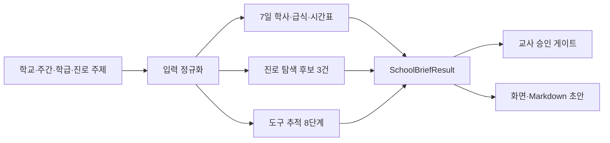

# SC Briefer

> **School & Career Data Briefer**  
> 학교 공개정보를 학생 평가가 아닌 **교사 검토용 주간 브리핑**으로 바꾸는 교육 데이터 도구입니다.

[](https://github.com/sumilee-pcu/Sc-Briefer/actions/workflows/ci.yml)

학교명·주 시작일·학년·반·진로 탐구 주제를 입력하면 7일 학사일정, 급식,
시간표, 진로 탐색 후보, 교사 승인 게이트와 근거 원장을 하나의 검토 초안으로
구성합니다.

> [!IMPORTANT]
> 현재 버전은 실제 학교 데이터가 아닌 **결정론적 합성 fixture**로 작동합니다.
> 외부 API와 LLM을 호출하지 않으며, 결과는 실제 학교 공지나 학생 개인에 관한
> 확정 판단이 아닙니다.

| 항목 | 현재 상태 |
|---|---|
| 실행 모드 | `Fixture Ready` |
| 기본 결과 | 7일 브리핑·진로 후보 3건·도구 추적 8단계 |
| 개인정보 | 입력·저장하지 않음 |
| 최종 판단 | 교사 승인 필요 |
| live API | 서버 어댑터 구현 전 |
| 검증 런타임 | Node.js 22 |

## 이 가이드에서 배우는 것

이 README는 제품 소개서이면서 직접 따라 하는 가이드북입니다. 순서대로 진행하면
다음을 수행할 수 있습니다.

1. 로컬에서 SC Briefer를 실행합니다.
2. 첫 주간 브리핑을 만들고 다섯 개 결과 영역을 읽습니다.
3. 공개데이터의 사실·해석·확인 필요 항목을 수업에서 구분합니다.
4. 결정론적 엔진과 개인정보 비저장 경계를 확인합니다.
5. 테스트와 프로덕션 빌드를 재현합니다.
6. NEIS·커리어넷·학교알리미 live 전환 순서와 완료 조건을 이해합니다.

## 10분 안에 첫 브리핑

### 1단계. 준비물을 확인합니다

- Git
- Node.js `22.13.0 이상, 23 미만`
- npm
- 최신 Chrome, Edge 또는 Safari

```bash
git clone https://github.com/sumilee-pcu/Sc-Briefer.git
cd Sc-Briefer
nvm install 22
nvm use 22
node --version
npm ci
npm run dev
```

Windows에서 nvm-windows를 사용한다면 다음처럼 실행할 수 있습니다.

```powershell
nvm install 22.19.0
nvm use 22.19.0
node --version
npm ci
npm run dev
```

브라우저에서 <http://localhost:3000>을 엽니다. `학교생활·진로 데이터 브리퍼`와
`FIXTURE READY`가 보이면 준비가 끝났습니다.

### 2단계. 실습값을 입력합니다

| 입력 항목 | 실습값 |
|---|---|
| 학교명 | 수원 미래중학교 |
| 주 시작일 | 2026-07-13 |
| 학년 | 2학년 |
| 반 | 1반 |
| 진로 탐구 주제 | AI·로봇 |

`주간 브리핑 생성`을 누릅니다. 현재 fixture는 같은 입력에 항상 같은 결과를
반환하므로 수업 시연과 회귀검사에 적합합니다.

### 3단계. 완료 조건을 확인합니다

- 주간 레코드: **7일**
- 진로 탐색 후보: **3건**
- 도구 추적: **8단계**
- 교사 승인 항목: **5건**
- 주말에 추정한 급식·시간표: **0건**
- 저장되는 학생 개인정보: **0건**

## 튜토리얼 1. 결과 화면 읽기

### A. 학교 식별 카드

학교명 옆의 `모의 매칭`은 실제 학교코드를 찾았다는 뜻이 아닙니다. live 전환 후에는
NEIS `schoolInfo`에서 교육청코드와 학교코드를 확인한 결과로 교체해야 합니다.

### B. 교사 승인 게이트

다섯 개 카드는 자동 확정이 가능한 항목과 사람이 확인해야 할 항목을 구분합니다.

| 게이트 | 현재 의미 | 교사가 확인할 것 |
|---|---|---|
| 학교 식별 | fixture 학교코드 | 실제 학교명·교육청·학교코드 |
| 일정 최신성 | 합성 주간자료 | 학교의 최종 공지와 변경사항 |
| 개인정보 비저장 | 통과 | 개인식별정보가 입력되지 않았는지 |
| 알레르기 해석 | 확인 필요 | 번호를 의료판정으로 오해하지 않는지 |
| 진로 표현 | 통과 | 적성 판정·확정 추천 문장이 없는지 |

### C. 7일 브리핑

요일 탭을 월요일부터 일요일까지 차례로 엽니다. 평일에는 학사일정·급식·시간표가
표시되고, 주말에는 `운영자료 없음`이 표시됩니다. 결측값을 평일 자료로 보간하거나
그럴듯하게 만들어내지 않는 것이 제품 원칙입니다.

### D. 진로 탐색 후보

직업 카드는 학생에게 맞는 직업을 판정하지 않습니다. 직업 후보의 설명을 읽고,
학생이 개선할 수 있는 탐구 질문과 활동을 제공합니다.

### E. 도구 추적과 근거 원장

도구 추적은 실제 API가 연결됐을 때 어떤 순서로 호출할지를 미리 검증하는 실행
기록입니다. 각 근거는 공급자, 원문 링크, 조회시각과 신뢰 상태를 가집니다.

## 튜토리얼 2. 조건을 바꾸어 비교하기

다음 실험을 한 가지씩 수행합니다.

1. 진로 주제를 `환경·생태`로 바꾸고 탐구 질문의 변화를 비교합니다.
2. 같은 조건을 두 번 실행하여 결과가 동일한지 확인합니다.
3. 반 입력에 문자를 넣고 안전한 기본값으로 정규화되는지 확인합니다.
4. `2026-99-99`처럼 존재하지 않는 날짜가 기본 실습일로 교정되는지 테스트합니다.
5. 토요일과 일요일에 합성 급식이 만들어지지 않는지 확인합니다.

비교 결과를 다음 세 열로 정리하면 공개데이터 리터러시 수업으로 확장할 수 있습니다.

| 사실 | 해석 | 확인 필요 |
|---|---|---|
| 원문 데이터가 제공한 값 | 수업을 위해 재구성한 설명 | 학교·교사가 최종 대조할 항목 |

## 튜토리얼 3. 수업에 적용하기

다음은 45분 수업 예시입니다.

| 단계 | 시간 | 교수·학습 활동 | 확인할 산출물 |
|---|---:|---|---|
| 도입 | 5분 | 공개데이터와 개인데이터의 차이를 질문합니다. | 입력 금지 정보 목록 |
| 실행 | 10분 | 학급 조건으로 주간 브리핑을 생성합니다. | 7일 브리핑 |
| 근거 분석 | 15분 | 사실·해석·확인 필요 항목을 분류합니다. | 근거 분류표 |
| 진로 탐구 | 10분 | 후보 1건을 골라 탐구 질문을 개선합니다. | 직업 탐구 질문 |
| 승인·성찰 | 5분 | 교사 승인 전 확정할 수 없는 항목을 찾습니다. | 승인 체크리스트 |

이 활동의 목표는 직업을 추천받는 것이 아닙니다. 공개데이터의 출처와 한계를 읽고,
검토 가능한 탐구 질문으로 전환하는 것이 목표입니다.

## 튜토리얼 4. 검토 초안 저장하기

`검토 초안 저장`을 누르면 다음 내용이 포함된 Markdown 파일이 내려받아집니다.

- 학교 식별 상태
- 7일 학사·급식·시간표
- 진로 탐색 후보와 질문
- 교사 승인 게이트
- 근거 원장과 조회시각
- 자료 공백과 주의사항

이 파일은 확정 공문이 아니라 수업 설계와 회의를 위한 초안입니다. 실제 배포 전에는
학교 최종 공지, 알레르기 원문, 날짜와 출처를 다시 확인합니다.

## 동작 원리



`runSchoolBrief()`는 입력 객체를 변경하지 않고 새로운 `SchoolBriefResult`를
반환합니다. 현재 엔진은 네트워크, 브라우저 저장소, 난수와 현재시각에 의존하지
않으므로 동일 입력에 동일 결과를 생성합니다.

학생명, 학번, 연락처, 건강정보와 심리검사 필드는 데이터 계약에 존재하지 않습니다.

## 개발자 가이드 1. 프로젝트 구조

```text
Sc-Briefer/
├─ app/
│  ├─ SchoolBriefLab.tsx       # 입력·결과·Markdown 저장 UI
│  ├─ globals.css              # 반응형 디자인 시스템
│  ├─ layout.tsx               # 한국어 메타데이터
│  └─ page.tsx                 # 제품 루트 /
├─ lib/
│  ├─ school-brief-engine.ts   # 결정론적 fixture 엔진
│  └─ providers.ts             # 서버 전용 live 준비 상태
├─ tests/
│  ├─ school-brief-engine.test.mjs
│  └─ repository-contract.test.mjs
├─ public/favicon.svg
├─ .env.example
├─ package.json
└─ README.md
```

live API의 `fetch`를 `SchoolBriefLab.tsx`나 `school-brief-engine.ts`에 직접 넣으면
인증키가 브라우저 번들로 들어갈 수 있습니다. 실제 연결은 향후
`app/api/brief/route.ts`와 서버 전용 공급자 어댑터에서 수행해야 합니다.

## 개발자 가이드 2. 테스트와 빌드

```bash
npm run lint
npm test
npm run build
```

세 단계를 한 번에 실행하려면 다음 명령을 사용합니다.

```bash
npm run check
```

검사 범위는 다음과 같습니다.

- 동일 입력의 결정론성과 입력 객체 불변성
- 달력상 유효한 날짜 정규화
- 7일 범위와 주말 무추정
- 급식 HTML 제거와 알레르기 번호 중복 제거·정렬
- 진로 후보 최대 3건과 확정적 적성판정 금지
- 출처·조회시각이 있는 도구 추적과 근거 원장
- 네트워크·저장소·난수·개인정보 필드 부재
- README·제품 셸·서버 비밀키 경계

GitHub Actions도 Node.js 22에서 lint → test → build 순서로 같은 검사를 실행합니다.

## 개발자 가이드 3. 실제 API로 전환하기

> [!WARNING]
> API 키를 `.env.local`에 넣는 것만으로 live 모드가 활성화되지는 않습니다.
> 현재 버전에는 실제 `fetch` 호출이 없습니다. 공급자 어댑터, 부분 실패 표시,
> 비밀키 검사와 회귀 테스트를 통과한 뒤에만 결과를 `live`로 표기합니다.

### 1단계. 서버 환경변수를 준비합니다

Windows PowerShell:

```powershell
Copy-Item .env.example .env.local
```

macOS·Linux:

```bash
cp .env.example .env.local
```

```env
SC_BRIEFER_DATA_MODE=fixture
NEIS_API_KEY=
CAREERNET_API_KEY=
SCHOOLINFO_API_KEY=
```

모든 인증키는 서버 전용 환경변수로 관리합니다. `NEXT_PUBLIC_` 접두사를 붙이거나
소스코드, 브라우저 번들, 로그, 스크린샷과 커밋에 포함하지 않습니다.

### 2단계. NEIS를 세로로 연결합니다

1. `schoolInfo`에서 학교명 후보를 조회합니다.
2. 교사가 선택한 `ATPT_OFCDC_SC_CODE`와 `SD_SCHUL_CODE`를 결합키로 확정합니다.
3. `SchoolSchedule`, `mealServiceDietInfo`, `misTimetable`을 독립 호출합니다.
4. 각 카드에 `live`, `partial`, `fixture`, `unavailable` 상태를 표시합니다.
5. 응답이 없으면 값을 만들지 않고 `자료 없음`으로 남깁니다.
6. `LOAD_DTM`, 조회시각, 엔드포인트와 키를 제외한 요청 조건을 근거 원장에 남깁니다.

| 데이터 | 공식 엔드포인트 | 핵심 조건 |
|---|---|---|
| 학교기본정보 | `https://open.neis.go.kr/hub/schoolInfo` | `SCHUL_NM`으로 후보 조회 |
| 학사일정 | `https://open.neis.go.kr/hub/SchoolSchedule` | 학교 결합키, 날짜 범위 |
| 급식 | `https://open.neis.go.kr/hub/mealServiceDietInfo` | 학교 결합키, 급식 날짜 |
| 중학교 시간표 | `https://open.neis.go.kr/hub/misTimetable` | 학교 결합키, 학년·반·교시 |

`misTimetable`은 중학교 전용입니다. 초등학교와 고등학교를 지원하려면 각각
`elsTimetable`, `hisTimetable` 어댑터로 분기합니다.

### 3단계. 진로 탐색 자료를 연결합니다

- 목록: `https://www.career.go.kr/cnet/front/openapi/juniorjobsinfo.json`
- 상세: `https://www.career.go.kr/cnet/front/openapi/juniorjobinfo.json`
- 진로교육자료: `svcCode=COSE`

커리어넷 신형 주니어 직업정보만 신규 구현 기반으로 사용합니다. 2023년 제공이
종료된 구 직업정보 API를 새 코드에 연결하지 않습니다. 직업정보는 학생 적합성
점수가 아니라 탐색 후보와 질문으로만 사용합니다.

### 4단계. 학교알리미를 별도 맥락으로 연결합니다

학교알리미는 급식·시간표 공급자가 아닙니다. 최근 공시자료를 이용해 학교의 연간
교육 여건을 보충하는 2차 근거로만 사용합니다. 공시항목별 기준시점이 다르고
지역코드가 변경될 수 있으므로 코드를 하드코딩하지 않습니다.

### 5단계. live 완료 게이트를 통과합니다

- 표본학교 10곳의 교육청·학교코드 매칭: **100%**
- 필수 응답 필드 유효율: **90% 이상**
- 공급자 실패 시 상태 표시율: **100%**
- 결측값 임의 생성: **0건**
- 브라우저에 노출된 인증키: **0건**
- 모든 결과의 출처·조회시각 표시율: **100%**
- 학교 공지 대조와 교사 승인 경로: **유지**

## 개인정보와 교사 승인 원칙

SC Briefer는 학생을 평가하는 시스템이 아니라, 교사가 공개정보의 근거와 공백을
검토하도록 돕는 초안 생성 도구입니다.

### 입력하지 않는 정보

- 학생명과 학번
- 연락처와 개인 상세주소
- 개인 건강·알레르기·장애 정보
- 심리검사와 적성검사 결과
- 학생의 현재 위치와 이동 이력

급식 알레르기 번호는 식단 전체의 원재료 표시이며 개인별 섭취 가능 여부나
의료판정이 아닙니다. 진로 카드는 적성 판정이나 확정 추천이 아니라 탐색 후보와
질문입니다. 학교 식별, 일정 최신성, 알레르기 해석과 최종 배포는 교사가 확인합니다.

## 제품 경계

SC Briefer는 학교 공개정보와 진로 탐구 근거에 집중합니다. 카카오 지도·경로,
장소·예약과 체험학습 일정 운영은 [Sup-Ro](https://github.com/sumilee-pcu/Sup-Ro)의
범위이며 이 저장소에서 중복 구현하지 않습니다.

## 문제 해결

| 증상 | 원인·해결 |
|---|---|
| Node 버전 경고가 표시됨 | Node 22로 전환한 뒤 `npm ci`를 다시 실행합니다. |
| API 키를 넣어도 fixture가 표시됨 | 정상입니다. 현재 버전은 live 어댑터가 구현되지 않았습니다. |
| 환경변수가 반영되지 않음 | `.env.local` 저장 후 개발 서버를 다시 시작합니다. |
| 주말 급식·시간표가 비어 있음 | 결측값을 추정하지 않는 의도된 동작입니다. |
| `npm ci`가 실패함 | `package.json`과 `package-lock.json`의 동기화를 확인합니다. |
| 한글이 깨져 보임 | 파일과 터미널 인코딩을 UTF-8로 맞춥니다. |
| 3000번 포트가 사용 중임 | 기존 서버를 종료하거나 `npm run dev -- -p 3001`을 사용합니다. |

## 로드맵

- [x] 결정론적 학교 브리퍼 엔진
- [x] 7일 브리핑·진로 후보·근거 원장 UI
- [x] Markdown 검토 초안 저장
- [x] 개인정보 비저장·교사 승인 경계
- [x] Node 22 단위검사·lint·프로덕션 빌드
- [ ] NEIS 학교 식별 live 세로조각
- [ ] 학사·급식·중학교 시간표 부분 실패 처리
- [ ] 커리어넷 주니어 직업정보·진로교육자료 연결
- [ ] 학교알리미 공시 맥락 연결
- [ ] 교육자 파일럿과 접근성 QA

## 공식 데이터 출처

- [NEIS 개발자 가이드](https://open.neis.go.kr/portal/guide/apiGuidePage.do)
- [NEIS 학교기본정보](https://open.neis.go.kr/portal/data/service/selectServicePage.do?infId=OPEN17020190531110010104913&infSeq=2)
- [NEIS 학사일정](https://open.neis.go.kr/portal/data/service/selectServicePage.do?infId=OPEN17220190722175038389180&infSeq=2)
- [NEIS 급식식단정보](https://open.neis.go.kr/portal/data/service/selectServicePage.do?infId=OPEN17320190722180924242823&infSeq=1)
- [NEIS 중학교 시간표](https://open.neis.go.kr/portal/data/service/selectServicePage.do?infId=OPEN15120190408165334348844&infSeq=2)
- [커리어넷 주니어 직업정보](https://www.career.go.kr/cnet/front/openapi/openApiJunior3Center.do)
- [커리어넷 진로교육자료](https://www.career.go.kr/cnet/front/openapi/openApiCoseCenter.do)
- [커리어넷 이용절차](https://www.career.go.kr/cnet/front/openapi/openApiUseGuideCenter.do)
- [학교알리미 Open API 안내](https://www.schoolinfo.go.kr/ng/go/pnnggo_a01_m0.do)
- [학교알리미 제공목록](https://www.schoolinfo.go.kr/ng/go/pnnggo_a01_l0.do)

---

SC Briefer의 목표는 더 많은 데이터를 보여주는 것이 아닙니다. **어떤 근거로 무엇을
판단했고, 무엇은 아직 사람이 확인해야 하는지**를 수업 가능한 형태로 드러내는 것이
목표입니다.
